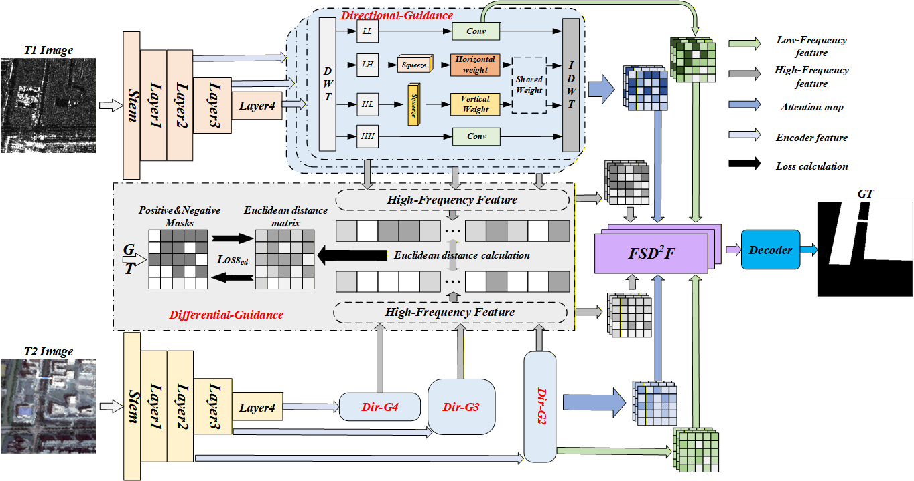

# WaveHFG: High-Frequency Guidance for Heterogeneous Remote Sensing Image Change Detection with Wavelet Features

---

### 📌 Quick Navigation
* [Abstract](#abstract)
* [Core Methodology](#core-methodology)
* [Pretrained Weights](#pretrained-weights)

---

## 📄 Abstract

Heterogeneous change detection (Hete-CD) between optical and synthetic aperture radar (SAR) images integrates detailed spectral information with all-weather observation capabilities. This approach aims to address the limitations of optical images, such as cloud cover and illumination variations, while mitigating speckle noise and enhancing the interpretability of SAR imagery. However, integrating these modalities poses challenges, including spectral inconsistencies and mismatched feature representations. To overcome these challenges, we propose a wavelet high-frequency guidance change detection (CD) network (WaveHFG). This approach utilizes wavelet-transform high-frequency features to enhance both the similarity and directional consistency of representations extracted from heterogeneous images. Our method incorporates two key modules: High-Frequency Differential-Guidance (Diff-G) and High-Frequency Directional-Guidance (Dir-G). These modules effectively capture subtle and often-overlooked details, hence improving the interpretability of the results. Additionally, the Frequency–Spatial Domain Difference Fusion (FSD\(^2\)F) module integrates features across multiple domains, providing a more comprehensive and detailed representation of change information. To rigorously evaluate the effectiveness of our proposed method, we constructed a new Hete-CD dataset with extensive coverage and increased complexity, encompassing a broader range of target categories to better reflect diverse real-world conditions. Extensive experiments on two publicly available datasets and our newly proposed dataset, demonstrate that our method outperforms state-of-the-art CD methods.

---

## 🖼️ Core Methodology

### 1. Network Architecture

  
**Figure: Construction of a heterogeneous remote sensing image CD network based on wavelet high-frequency guidance.

---

## 💾 Pretrained Weights

Pretrained weights for **WaveHFG** are available here:

* **Baidu Netdisk**: [Download Link](https://pan.baidu.com/s/1J64daf5cYQyb0leKoROOqQ)  
  **Extraction Code**: `ixus`

---

## 📜 Citation

If you find this work helpful for your research, please cite our paper:

```bibtex
@article{song2026wavehfg,
  title={WaveHFG: High-Frequency Guidance for Heterogeneous Remote Sensing Image Change Detection with Wavelet Features},
  author={Song, Xinyang and Gao, Yunhao and Zhang, Mengmeng and Li, Wei and Tao, Ran},
  journal={IEEE Transactions on Geoscience and Remote Sensing},
  year={2026},
  volume={64},
  number={},
  pages={1-14},
  publisher={IEEE}
}
